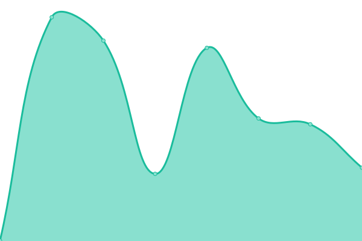

# [📈 Live Status](https://status.x86.se): <!--live status--> **🟧 Partial outage**

This repository contains the open-source uptime monitor and status page for [Erik Skogh](https://status.x86.se), powered by [Upptime](https://github.com/upptime/upptime).

With [Upptime](https://upptime.js.org), you can get your own unlimited and free uptime monitor and status page, powered entirely by a GitHub repository. We use [Issues](https://github.com/eskogh/upptime/issues) as incident reports, [Actions](https://github.com/eskogh/upptime/actions) as uptime monitors, and [Pages](https://status.x86.se) for the status page.

<!--start: status pages-->
<!-- This summary is generated by Upptime (https://github.com/upptime/upptime) -->
<!-- Do not edit this manually, your changes will be overwritten -->
<!-- prettier-ignore -->
| URL | Status | History | Response Time | Uptime |
| --- | ------ | ------- | ------------- | ------ |
|  [x86.se](https://x86.se/upptime-health) | 🟥 Down | [x86-se.yml](https://github.com/eskogh/upptime/commits/HEAD/history/x86-se.yml) | 

 837ms
     
 | 

<a href="https://status.x86.se/history/x86-se">0.00%</a>
    

|  [resume.skogh.org](https://resume.skogh.org/upptime-health) | 🟥 Down | [resume-skogh-org.yml](https://github.com/eskogh/upptime/commits/HEAD/history/resume-skogh-org.yml) | 

 221ms
     
 | 

<a href="https://status.x86.se/history/resume-skogh-org">100.00%</a>
    

|  [Shinobi NVR](https://nvr.x86.se) | 🟩 Up | [shinobi-nvr.yml](https://github.com/eskogh/upptime/commits/HEAD/history/shinobi-nvr.yml) | 

 533ms
     
 | 

<a href="https://status.x86.se/history/shinobi-nvr">34.03%</a>
    

|  [upload.linux.army](https://upload.linux.army/upptime-health) | 🟥 Down | [upload-linux-army.yml](https://github.com/eskogh/upptime/commits/HEAD/history/upload-linux-army.yml) | 

 332ms
     
 | 

<a href="https://status.x86.se/history/upload-linux-army">100.00%</a>
    

|  [Homeassistant](https://homeassistant.senate.sx:8123) | 🟩 Up | [homeassistant.yml](https://github.com/eskogh/upptime/commits/HEAD/history/homeassistant.yml) | 

 575ms
     
 | 

<a href="https://status.x86.se/history/homeassistant">100.00%</a>
    

<!--end: status pages-->

[**Visit our status website →**](https://status.x86.se)

## 📄 License

- Powered by: [Upptime](https://github.com/upptime/upptime)
- Code: [MIT](./LICENSE) © [Anand Chowdhary](https://anandchowdhary.com), supported by [Pabio](https://pabio.com)
- Data in the `./history` directory: [Open Database License](https://opendatacommons.org/licenses/odbl/1-0/)
